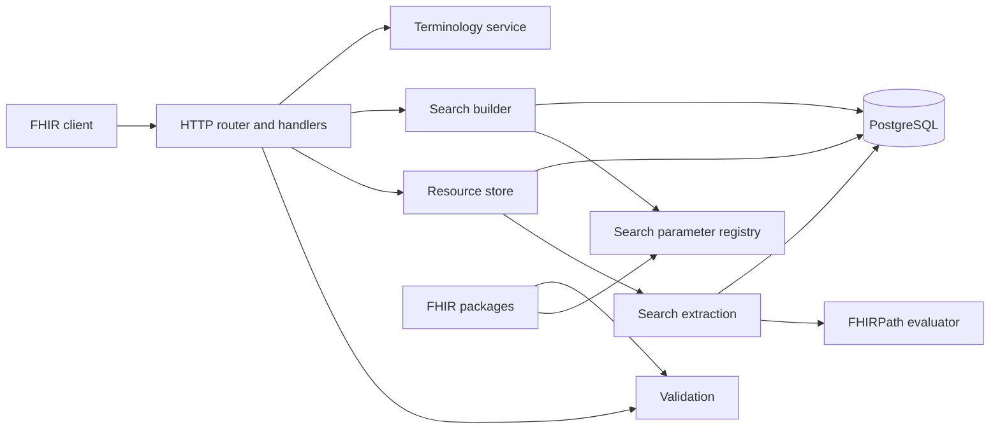

# How requests move through the server

WSO2 FHIR Server is a single Go service connected to PostgreSQL. HTTP handlers coordinate storage, validation, search, indexing, and terminology integrations through focused internal packages.

## Package responsibilities

| Package | Responsibility |
| --- | --- |
| `cmd/server` | Configuration, dependency wiring, startup, and shutdown |
| `internal/handler` | Routing, content negotiation, FHIR interactions, and OperationOutcome responses |
| `internal/store` | CRUD, transactions, history, versioning, and SQL query construction |
| `internal/index` | Write-time extraction into typed search tables |
| `internal/fhirpath` | FHIRPath parsing and evaluation |
| `internal/validate` | Base structural and profile validation |
| `internal/ig` | Implementation Guide package loading |
| `internal/terminology` | External terminology calls and closure bookkeeping |
| `internal/tenant` | Tenant resolution and PostgreSQL tenant scope |

## Write lifecycle

1. The router resolves the tenant and negotiates the FHIR representation.
2. The handler decodes the resource and applies configured validation.
3. The store opens a PostgreSQL transaction and sets the tenant scope.
4. The current resource is created or updated and its version advances.
5. An immutable history snapshot is appended.
6. Search values are extracted and the resource's `sp_*` rows are refreshed.
7. The transaction commits all changes atomically.

## Search lifecycle

1. The handler parses query parameters and resolves the tenant.
2. The search registry determines each parameter's type and expression.
3. The store builds predicates against the corresponding `sp_*` tables.
4. PostgreSQL identifies and orders matching resource IDs.
5. The full JSON documents are loaded and returned in a searchset Bundle.

## Startup lifecycle

The service loads configuration, connects to PostgreSQL, prepares the schema when explicitly enabled, seeds base R4 definitions, and initializes the search registry. Implementation Guides can load during startup; readiness remains closed until required initialization completes.

For design rationale and accepted tradeoffs, read [`DESIGN.md`](https://github.com/wso2/fhir-server/blob/main/DESIGN.md).
