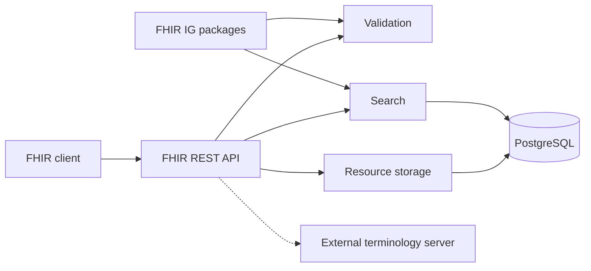

# A blazing-fast, lightweight FHIR server written in Go

WSO2 FHIR Server is a single binary that speaks FHIR R4 over REST and stores everything in PostgreSQL. There is nothing else to deploy: one service, one database.

## What it can do

- Full FHIR REST interactions: create, read, update, patch, delete, versioned read, and history.
- FHIR search across string, token, date, number, quantity, URI, reference, and composite parameters, including chained and reverse-chained queries.
- Transaction and batch Bundles with atomic transaction semantics.
- Base R4 validation on every write, plus profile validation against loaded Implementation Guides and `$validate`.
- Implementation Guide packages loaded at startup from the FHIR package registry.
- Terminology-backed search (`:in`, `:below`, and related modifiers) through an external terminology server.
- Patient, Encounter, and Practitioner compartment search and `$everything`.
- Single-tenant and shared multi-tenant deployment models.
- JSON, XML, and Turtle representations negotiated per request.

See [supported resource types](../reference/resource-types.md) for what you can store and the [FHIR API reference](../reference/api.md) for how to call it.

## How it fits together

All resource types share one storage model: resources are stored as JSON documents with their full version history, and the values used by search are extracted into typed indexes at write time. A write and its history snapshot and search-index updates commit in a single database transaction, so a resource is never searchable in a state that was not stored.

Searches run against the typed indexes first and load the matching JSON documents last, which keeps queries predictable as data grows. [Storage](./storage.md) covers this model in more depth.

## What stays outside

The server deliberately delegates two concerns:

- **Terminology reasoning** — ValueSet expansion and code hierarchy questions go to a FHIR terminology server you configure.
- **Identity and policy** — authentication, authorization, and TLS termination belong to the gateway or ingress in front of the server. See [Deployment](../operations/deployment.md).

For design rationale and accepted tradeoffs, read [`DESIGN.md`](https://github.com/wso2/fhir-server/blob/main/DESIGN.md).
